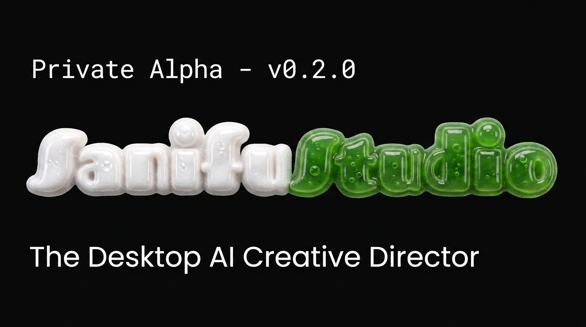

<div align="center">


# SanifuStudio

**The AI-powered creative director for content strategy, multi-track scripting, and campaign execution.**

[](https://github.com/Mafabi-Innovations/SanifuStudio/releases)
[](https://github.com/Mafabi-Innovations/SanifuStudio/releases)
[](#)

<br />



</div>

---

## Overview

SanifuStudio is a desktop workspace built for creators, brands, and solo operators who need strategic content output without creative burnout or agency overhead. Rather than relying on disconnected chat windows and shallow AI prompts, SanifuStudio acts as your co-director—turning raw ideas into calibrated, production-ready video scripts and full-month publishing calendars.

## The Problem Solved

Traditional AI prompt tools generate disconnected, generic copy that loses your authentic voice and requires extensive manual rewriting. SanifuStudio replaces blank prompt boxes with structured directorial workflows:

- **Eliminates Voice Drift**: Remembers your tone, target audience, and niche permanently.
- **Bridges Ideation to Production**: Generates multi-track scripts with concrete visual cues, voiceover lines, and B-roll notes ready for the camera.
- **Solves Inconsistency**: Plans cohesive multi-stage campaigns instead of isolated, one-off posts.

## Core Capabilities

### Brand DNA Engine
Define your niche, core values, and audience profile once. SanifuStudio anchors your identity across all generated content so you never have to re-explain who you are or who you speak to.
- **Persistent Identity**: Preserves tone, vocabulary, and perspective across sessions.
- **Audience Calibration**: Hooks tailored to your target viewer's psychographics.
- **Zero Generic Output**: Strategic, voice-accurate scripting built directly into your workflow.

### Director's Timeline & Script Editor
Take command over every scene with parallel multi-track lanes organizing visual cues, voiceover timing, and on-screen directions.
- **Multi-Track Alignment**: Synchronize camera cues, shot pacing, voiceover scripts, and B-roll directives.
- **Platform-Native Formatting**: Auto-optimizes hooks, pacing, and retention structures for TikTok, Reels, YouTube Shorts, and long-form video.
- **Granular Regeneration**: Fine-tune individual scenes and prompts without regenerating the entire script.

### 30-Day Content Calendar
Transition from uncertain daily ideation to a cohesive multi-week strategy in under a minute.
- **Phased Campaign Arcs**: Structure narratives across awareness, trust-building, and conversion.
- **Multi-Platform Coordination**: Synchronize cadence across YouTube, TikTok, Instagram, and LinkedIn.
- **Burnout-Proof Batching**: Plan an entire month of interconnected material in a single focused session.

## Workflow

```
[ 01. Identity ]  Define Brand DNA, target audience, and content pillars once.
       │
[ 02. Format ]    Select delivery platform, sprint duration, and campaign objective.
       │
[ 03. Direction ] Refine scene-by-scene prompts on the Director's Timeline and export.
```

## Download & Installation

SanifuStudio desktop binaries are published on the official releases page:

1. Navigate to the **[Latest Release](https://github.com/Mafabi-Innovations/SanifuStudio/releases/latest)**.
2. Download the installer for your operating system (`SanifuStudio-Setup-x.x.x.exe`).
3. Run the installer and follow the on-screen setup prompts.
4. Launch SanifuStudio and configure your initial Brand DNA profile to begin.

---

**Glory to GOD**  
*By Emmanuel Mafabi Israel, Mafabi Innovations*
